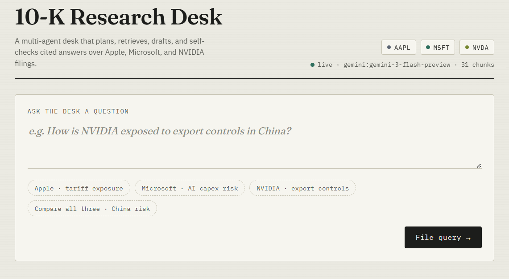
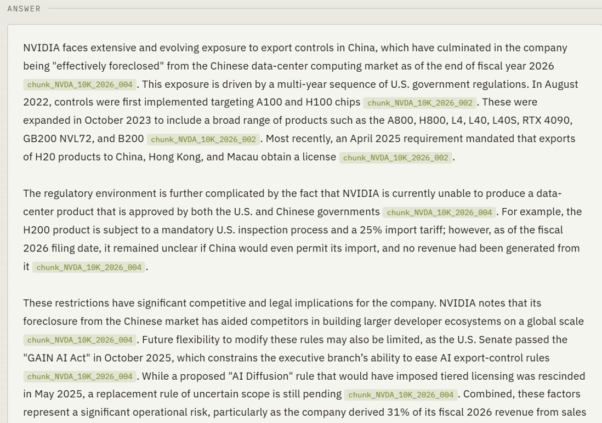
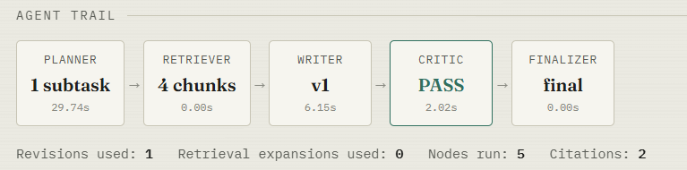
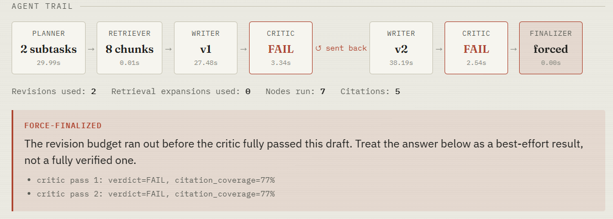
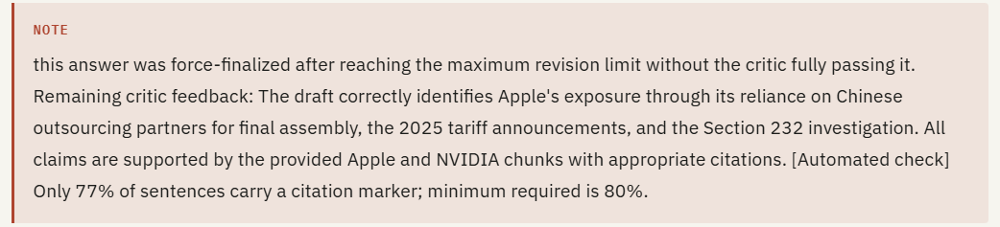
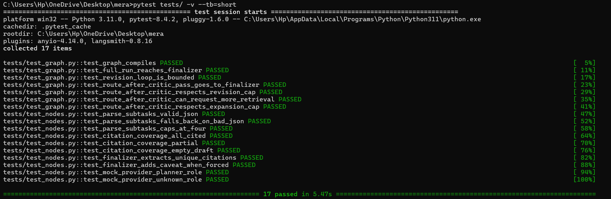
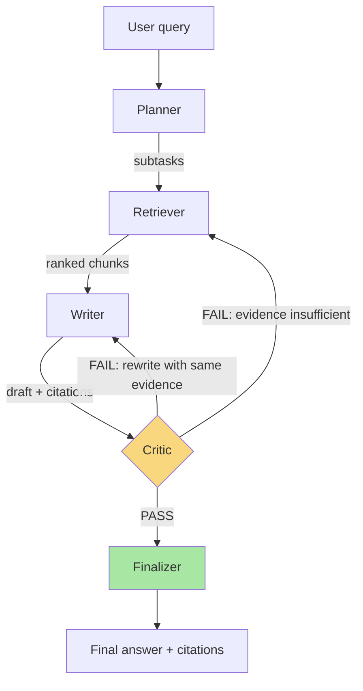

# Multi-Agent Enterprise Research Assistant

A multi-agent system that plans, retrieves, drafts, and **self-verifies** cited
answers to research questions over a corpus of SEC 10-K filings (Apple,
Microsoft, NVIDIA). Built with LangGraph, FAISS, and swappable Claude/OpenAI/
Gemini providers.

Unlike a single-shot RAG assistant, every draft answer here is checked by a
separate critic agent against the retrieved evidence before it reaches the
user — unsupported claims get sent back for revision (or trigger another
retrieval pass) instead of shipping.

## Demo

The repo ships a static single-page frontend (`research-desk.html`) that
talks to the `/query` and `/health` endpoints — no build step, just open it
against a running API. A few screenshots from a live run:

**The desk itself** — ask a question, or use one of the seeded prompts per
company (or across all three). The status bar reports the active provider,
model, and index size straight from `/health` (this run against
`gemini:gemini-3-flash-preview`, 31 chunks indexed):



**A clean pass** — "How is NVIDIA exposed to export controls in China?"
resolves in one writer draft. Every paragraph carries inline citation chips
back to the specific 10-K chunk it came from:



The agent trail underneath shows exactly what ran: one planner subtask, four
retrieved chunks, a single writer draft, and a critic `PASS` — 5 nodes total,
0 retrieval expansions, 2 citations:



**A harder, multi-part query** exercises the actual point of this project —
the revise/re-retrieve loop. Here the critic fails the draft twice in a row,
the writer gets two shots at revising against the same evidence, and once
the revision budget (`MAX_WRITER_REVISIONS=2`) is exhausted the graph
force-finalizes rather than looping forever:



The finalizer surfaces *why* it gave up as a visible caveat instead of
silently shipping a shaky answer — here, the programmatic citation-coverage
check (77% of sentences cited vs. an 80% floor) is what kept failing, even
though the LLM critic judged the underlying claims correct:



This is the "no uncited claims reach the user" guarantee from the
[Why this project](#why-this-project-vs-a-single-agent-rag-assistant) section
in action: when the critic and the programmatic check disagree on strictness,
the system is honest about it rather than picking whichever one passes.

**The test suite backing all of this** — the offline `pytest tests/` run
referenced throughout this README (see [Testing](#mlops)), mock-provider
only, no API keys needed:



## Architecture



**Termination guarantee:** the critic can only route back to the writer
`MAX_WRITER_REVISIONS` times and back to the retriever
`MAX_RETRIEVAL_EXPANSIONS` times (both configurable, defaults 2 and 1). Once
both budgets are exhausted the graph force-finalizes with a visible caveat
rather than looping forever — verified in `tests/test_graph.py`, and visible
live in the demo screenshots above.

### State schema

See `src/graph/state.py` for the full typed `GraphState`. Key fields:
`query`, `subtasks`, `retrieved_chunks` (with scores + section tags),
`draft_answer`, `critic_verdict` (verdict/feedback/route_to), `revision_count`,
`retrieval_expansion_count`, `final_answer`, `citations`, and an append-only
`trace` log used for the API's "which nodes ran" field (this is what powers
the agent-trail cards in the demo UI).

## Why this project (vs. a single-agent RAG assistant)

This project exists specifically to demonstrate **multi-agent orchestration**
with genuine conditional routing and a self-verification loop — not just
"retrieve then generate." Every claim in the final answer is required to
carry a citation back to a specific retrieved chunk, and a programmatic
citation-coverage check backs up the LLM critic's judgment so the safety
property (no uncited claims reach the user) doesn't depend entirely on the
critic being lenient or strict.

## Quickstart

```bash
git clone <your-repo-url> && cd mera
python3 -m venv .venv && source .venv/bin/activate
pip install -r requirements.txt
cp .env.example .env   # fill in ANTHROPIC_API_KEY (or leave LLM_PROVIDER=mock to try it with no key)

# Build the FAISS index from data/raw/ (offline, no network/API key needed)
python -m src.ingest.build_index

# Run the API
uvicorn src.api.main:app --reload

# In another terminal:
curl -X POST http://localhost:8000/query \
  -H "Content-Type: application/json" \
  -d '{"query": "How is NVIDIA exposed to export controls in China?"}'
```

Or with Docker:

```bash
docker compose up --build
```

### Trying it with the demo UI

`research-desk.html` at the repo root is a static, dependency-free page (the
one in the screenshots above) that hits the same `/query` and `/health`
endpoints as the `curl` example. With the API running on `localhost:8000`,
just open the file directly in a browser — no separate frontend build or
server required.

### Running with no API key at all

Set `LLM_PROVIDER=mock` in `.env` (or `export LLM_PROVIDER=mock`) and every
node runs against a deterministic rule-based provider instead of a real LLM.
This is what the test suite and CI use — it proves the graph's routing and
loop-termination logic without needing a paid API call. Answer *content*
obviously won't be meaningful in mock mode; use a real provider for that.

## Provider swapping

Every external call is behind an interface (`src/providers/base.py`).
Nothing in `src/graph/` imports `anthropic`, `openai`, or `google-genai`
directly.

```bash
LLM_PROVIDER=openai OPENAI_MODEL=gpt-4o-mini uvicorn src.api.main:app
LLM_PROVIDER=gemini GEMINI_MODEL=gemini-3-flash-preview uvicorn src.api.main:app
EMBEDDING_PROVIDER=sentence-transformers uvicorn src.api.main:app   # needs a one-time model download
```

| Setting | Options | Notes |
|---|---|---|
| `LLM_PROVIDER` | `anthropic` \| `openai` \| `gemini` \| `mock` | `mock` needs no key, used by tests/CI. `gemini` is backed by the `google-genai` SDK (see `requirements.txt`) — the demo screenshots above were run against `gemini-3-flash-preview`. |
| `EMBEDDING_PROVIDER` | `local-tfidf` \| `sentence-transformers` \| `openai` | see below |

**On `local-tfidf` as the default embedding provider:** it's not a placeholder
— it's a real TF-IDF-over-hashed-features embedder with no model download and
no network call, which is what lets `build_index.py` and the test suite run
in network-restricted environments (including the sandbox this project was
originally built in, and most CI runners without secrets configured). It will
retrieve noticeably worse than a transformer embedding on paraphrased or
semantically-distant queries — confirmed during development (a direct
"Apple tariffs" query didn't surface the most on-topic chunk in the top-3
despite that chunk existing in the index). Switch to
`EMBEDDING_PROVIDER=sentence-transformers` for real retrieval quality; the
interface is identical, only the config string changes.

## Project structure

```
├── data/raw/              SEC 10-K excerpts (Apple, Microsoft, NVIDIA), source-linked
├── data/processed/        FAISS index + chunk metadata (rebuildable, see below)
├── src/config.py          every provider/threshold choice, env-driven
├── src/providers/         LLM + embedding provider interfaces and implementations
├── src/ingest/            chunking + index build script
├── src/graph/             typed state, 5 nodes, graph assembly + routing
├── src/prompts/           planner/writer/critic prompt templates (not inlined in code)
├── src/api/                FastAPI app (/query, /health)
├── research-desk.html     static demo frontend (no build step, hits /query + /health)
├── eval/                   RAGAS harness + held-out QA test set
├── tests/                  17 tests, all offline (mock provider)
├── deploy/                 ECS task def + Lambda handler (not auto-deployed)
```

## Rebuilding the corpus / index

```bash
# add more filings as .txt files to data/raw/ (see existing files for the
# expected header format: SOURCE/COMPANY/FILED/URL + a "====" separator)
python -m src.ingest.build_index
```

**Scaling the index:** `IndexFlatIP` (exact search) is the right choice at
this corpus's scale (tens of chunks). If you extend this to a much larger
corpus (hundreds of thousands of chunks), swap to `faiss.IndexIVFFlat` or an
HNSW index in `build_index.py` — the retriever node doesn't need to change,
since it only calls `index.search()`.

## Evaluation

```bash
ANTHROPIC_API_KEY=... python eval/run_ragas.py
ANTHROPIC_API_KEY=... python eval/run_ragas.py --fail-under 0.7   # CI quality-gate mode
```

Runs the 10-question held-out set in `eval/qa_testset.jsonl` through the real
graph and scores faithfulness, context precision, context recall (and answer
relevancy, if an embeddings backend is configured) with RAGAS. Writes
`eval/report.json` and `eval/report.md`. This requires a real `LLM_PROVIDER`
(RAGAS's metrics need a real LLM judge) — `LLM_PROVIDER=mock` is rejected
with a clear error here, since mock scores would be meaningless.

**A dependency note worth knowing about, not hiding:** while wiring this up,
`ragas==0.4.x` failed to import against current `langchain-community` (it
references a `langchain_community.chat_models.vertexai` submodule that
`langchain-community` removed in its 0.4.x line). Fixed by pinning
`langchain-community==0.3.27` in `requirements.txt`, verified this does
*not* downgrade the `langchain-core`/`langgraph` versions the rest of the
app depends on. Documented inline in `requirements.txt` in case a future
`ragas` release makes the pin unnecessary.

## MLOps

- **CI** (`.github/workflows/ci.yml`): ruff lint → build index offline →
  `pytest` with the mock provider (no secrets needed) → Docker build → RAGAS
  quality gate (runs only if `ANTHROPIC_API_KEY` is configured as a repo
  secret; no-ops cleanly otherwise instead of failing forks/external PRs).
- **Run tracking**: every `/query` call is logged to MLflow (`src/api/main.py`)
  with the query, provider/model names, latency, revision count, retrieval
  expansion count, and citation count. Local file-store backend by default
  (`mlflow ui --backend-store-uri file:./mlruns` to browse); point
  `MLFLOW_TRACKING_URI` at a remote server for a team setup.
- **Structured logging**: every node emits a trace entry (`node`,
  `duration_s`, `output_summary`, provider name) collected in `GraphState.trace`
  and returned in the API response, so any run is inspectable without
  re-running it — this is the same trace data the demo UI's "agent trail"
  cards render.

## Deploying to AWS

**Not deployed automatically by this repo** — provisioning real cloud
resources costs money, so `deploy/` contains templates, not live
infrastructure.

- `deploy/ecs-task-def.json` — Fargate task definition template. Fill in
  `<ACCOUNT_ID>`/`<REGION>`, push the Docker image to ECR, register with
  `aws ecs register-task-definition`, put your API key in Secrets Manager
  (referenced via `secrets`, not `environment`, in the template).
- `deploy/lambda_handler.py` — Mangum adapter for a pay-per-request Lambda +
  API Gateway deployment. Use `EMBEDDING_PROVIDER=local-tfidf` for this path
  specifically — `sentence-transformers` (which pulls in `torch`) pushes the
  package past Lambda's size limits unless you use the container-image
  deployment path (also documented in that file's docstring).

The `Dockerfile` builds the FAISS index at image-build time (`local-tfidf`
by default, overridable via the `EMBEDDING_PROVIDER` build arg) so the
container starts ready to serve, defaults `LLM_PROVIDER=anthropic` at
runtime, and exposes a `/health`-based `HEALTHCHECK` on port 8000.

## What this demonstrates (for recruiters / portfolio)

- **Multi-agent orchestration, not single-shot RAG**: a 5-node LangGraph
  graph with genuine conditional routing — the critic can send work back to
  either the writer (rewrite) or the retriever (get better evidence), with
  bounded retry budgets that guarantee termination (unit-tested, and visible
  in the demo's force-finalize screenshot above).
- **Grounded, self-verified answers**: a programmatic citation-coverage floor
  backs up the LLM critic, so the "no uncited claims" property doesn't
  depend entirely on the critic's judgment.
- **Provider-agnostic design**: swapping `LLM_PROVIDER` (Anthropic, OpenAI,
  or Gemini) or `EMBEDDING_PROVIDER` touches zero graph/node code — verified
  by the mock provider being what the entire test suite runs against.
- **Real MLOps hygiene**: CI that lints, tests offline, builds the container,
  and gates on RAGAS scores; per-query run tracking; structured, inspectable
  traces.
- **Honest engineering under real constraints**: this README documents a
  genuine upstream dependency conflict found and fixed during development
  (see Evaluation section) rather than glossing over it — the kind of thing
  that actually happens building production systems.

## Differentiation from other RAG projects

Compare this to a single-agent RAG assistant using one LLM + one vector
store with no verification step: this project adds (1) a planning stage that
decomposes multi-part questions into targeted retrieval subtasks, (2) an
independent critic agent with a bounded revise/re-retrieve loop instead of
returning the first draft, and (3) quantitative RAGAS evaluation wired into
CI as a quality gate, instead of eyeballing whether answers look right.
